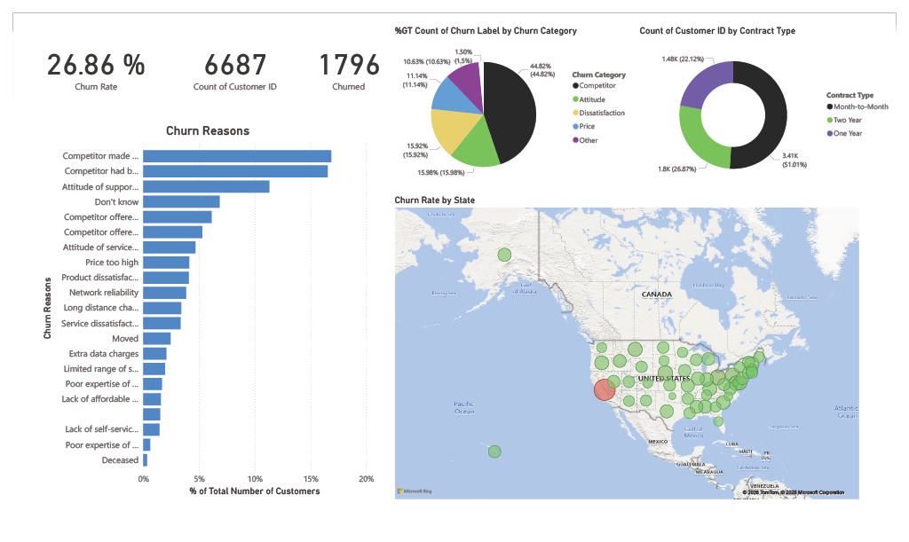
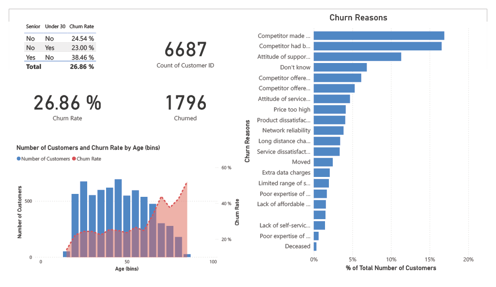
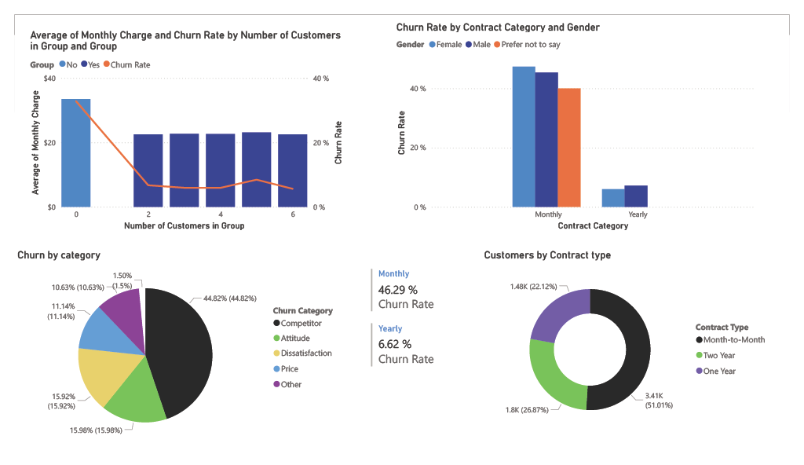
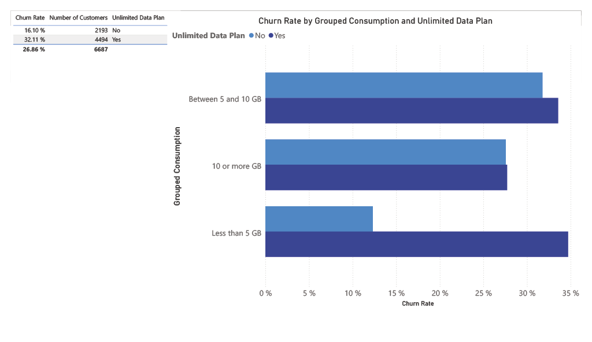
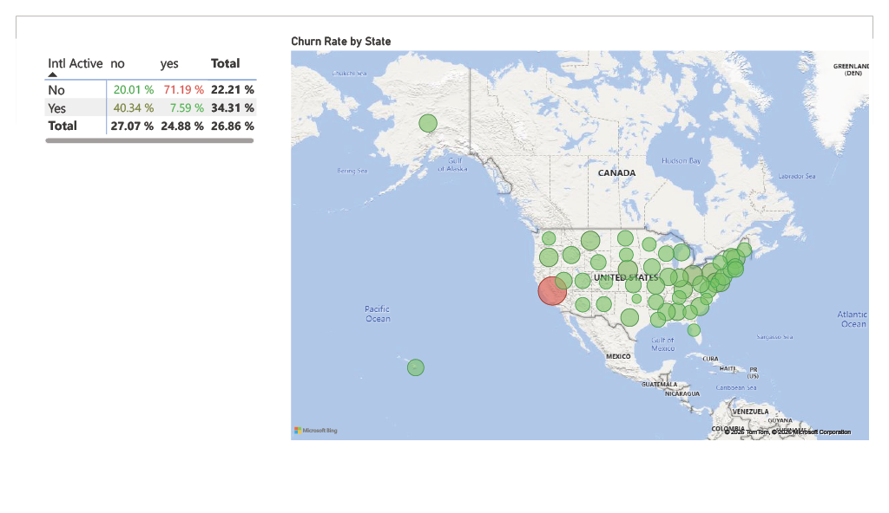
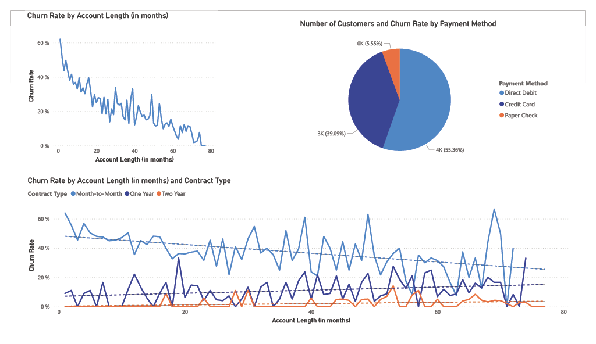
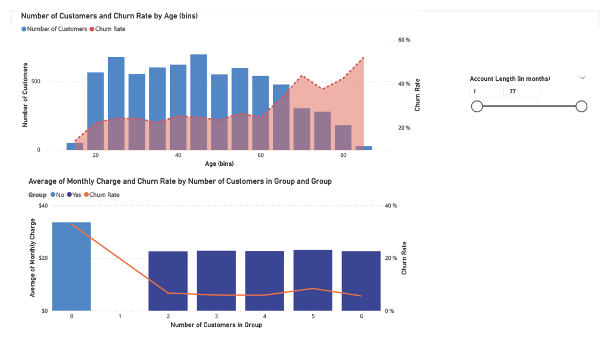
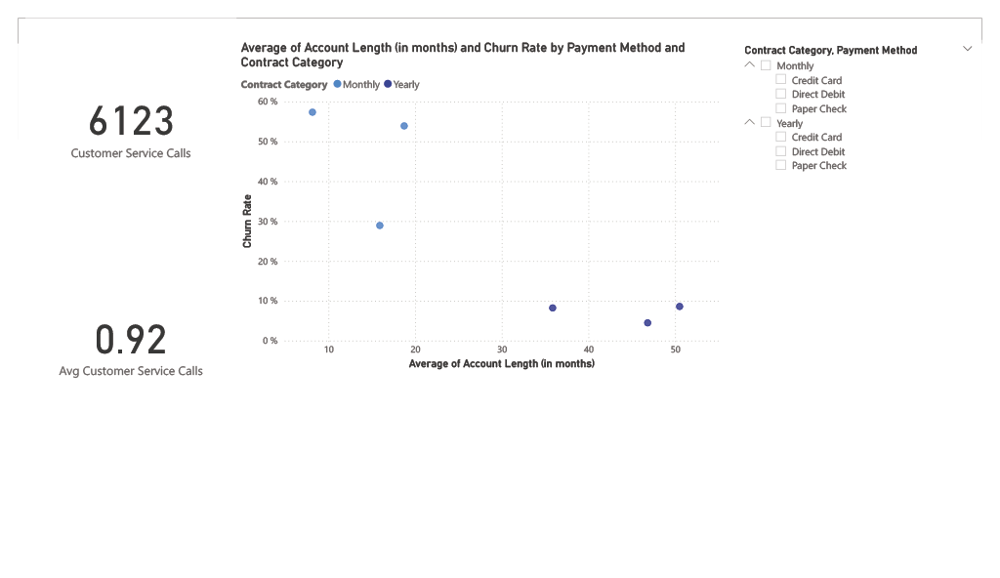
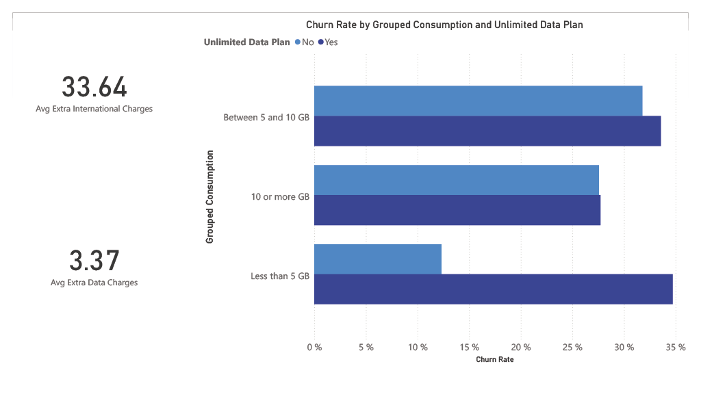
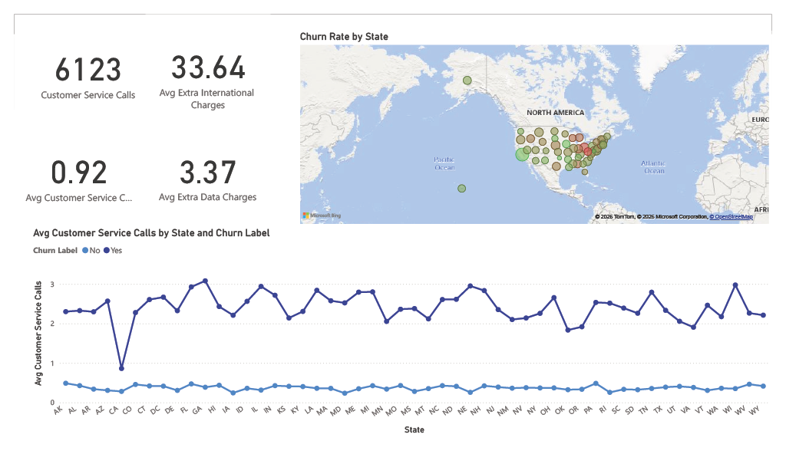

# Customer Churn Analytics Dashboard — Databel Telecom

> Power BI · Power Query · DAX · 10-Page Dashboard · 6,687 Customers · Telecom Industry

A fully interactive 10-page Power BI dashboard analysing customer churn for Databel, a fictional telecom operator. Built end-to-end from raw CSV data through Power Query transformation, DAX measure development, and multi-page dashboard design covering demographics, contract analysis, geographic distribution, data plan behaviour, international usage, payment patterns, and service quality signals.

---

## Dashboard Overview



**26.86% overall churn rate across 6,687 customers — 1,796 lost.**

---

## Key Metrics at a Glance

| Metric | Value |
|--------|-------|
| Total Customers | 6,687 |
| Churned Customers | **1,796** |
| Overall Churn Rate | **26.86%** |
| Retained Customers | 4,891 |
| Month-to-Month Churn Rate | **46.29%** |
| Two-Year Contract Churn Rate | **2.8%** |
| Senior Customer Churn Rate | **38.46%** |
| Highest Churn State | California — **63.2%** |
| Primary Churn Driver | Competitor offers — **44.82%** of all churns |
| Total Customer Service Calls | 6,123 |
| Avg Extra International Charges | $33.64 |
| Avg Extra Data Charges | $3.37 |

---

## Business Problem

Databel is losing more than 1 in 4 customers. This dashboard was built to answer five core business questions:

1. What is the overall churn rate and which customer segments are at highest risk?
2. Why are customers leaving — and which category of reason dominates?
3. How does contract type, payment method, and account tenure affect churn?
4. Are there geographic or usage-based patterns that explain churn concentration?
5. What does the service quality data reveal about the customer experience before churn?

---

## Dashboard Pages

---

### Page 1 — Overview: Churn Rate, Demographics and Reasons

**Key visuals:** Senior vs Under 30 churn matrix · Churn rate by age bins · Full churn reasons bar chart · Headline KPIs



The opening page establishes the headline numbers: **26.86% churn rate**, 6,687 customers, 1,796 churned. The age distribution chart reveals that churn rate rises sharply for older customers, with the 65+ bracket showing the steepest increase. The Senior/Under 30 matrix breaks this down further:

| Senior | Under 30 | Churn Rate |
|--------|----------|-----------|
| No | No | 24.54% |
| No | Yes | 23.00% |
| Yes | No | **38.46%** |
| **Total** | | **26.86%** |

The churn reasons bar chart shows 20 distinct reasons. The top five are competitor made a better offer, competitor had better devices, attitude of support person, don't know, and competitor offered more data — all pointing toward competitive pressure and service quality as the dominant themes.

---

### Page 2 — Contract Type, Gender and Churn Categories

**Key visuals:** Churn by category donut · Contract type distribution donut · Churn rate by contract and gender · Group plan analysis



The contract type breakdown is the single most actionable finding in the dashboard:

| Contract Type | Customers | Churn Rate |
|---------------|-----------|-----------|
| Month-to-Month | 3,410 (51%) | **46.29%** |
| One Year | 1,480 (22%) | 11.3% |
| Two Year | 1,797 (27%) | **2.8%** |

Month-to-month customers churn at **16x the rate** of two-year contract holders. The churn category donut shows competitors account for **44.82%** of all churns, followed by attitude (15.98%), dissatisfaction (15.92%), price (11.14%), and other (10.63%). The group plan analysis shows that customers in larger groups (5–6 people) have lower monthly charges and lower churn rates, suggesting group discounts drive loyalty.

---

### Page 3 — Unlimited Data Plan and Consumption Behaviour

**Key visuals:** Churn rate by grouped data consumption and unlimited plan status · Summary table



| Unlimited Data Plan | Customers | Churn Rate |
|--------------------|-----------|-----------|
| No | 2,193 | **16.10%** |
| Yes | 4,494 | **32.11%** |

Customers with unlimited data plans churn at **twice the rate** of those without. The grouped consumption breakdown reveals the paradox: customers consuming 10 or more GB per month on an unlimited plan churn at a much higher rate than light users without a plan. This suggests the unlimited plan pricing is not delivering perceived value for heavy users, who are likely being targeted by competitors with better data offers.

---

### Page 4 — International Plan and Geographic Distribution

**Key visuals:** International active vs plan matrix · Churn rate by state map



The international plan matrix reveals a critical mismatch:

| Has Intl Plan | Intl Active: No | Intl Active: Yes |
|--------------|-----------------|-----------------|
| No | 20.01% | **71.19%** |
| Yes | 40.34% | 7.59% |

Customers who are **internationally active but have no international plan churn at 71.19%** — by far the highest segment in the entire dataset. This represents a clear and fixable problem: these customers are paying extra data charges ($33.64 average) and churning because they have not been offered the right plan. Conversely, customers with an international plan who are actually using it churn at just 7.59%.

The geographic map shows California as the dominant red outlier at **63.2%** churn, with all other states showing green (below average). Ohio, Pennsylvania, Maryland, and Nebraska round out the top five highest churn states.

---

### Page 5 — Account Tenure, Contract Type and Payment Method

**Key visuals:** Churn rate by account length and contract type · Churn rate by account length overall · Customer count by payment method



Churn rate on month-to-month contracts remains elevated throughout the entire account lifetime — it never stabilises the way one-year and two-year contracts do. Two-year contract customers show near-zero churn regardless of tenure, confirming that contract commitment is a stronger retention signal than how long someone has been a customer.

Payment method distribution: Direct Debit (55%, 3.7K customers), Credit Card (39%, 2.6K customers), Paper Check (6%, 370 customers). Despite being the smallest group, paper check customers have the highest churn rate at 38.0% vs credit card at 14.5% — suggesting that payment friction correlates with disengagement.

---

### Page 6 — Full Summary Dashboard

**Key visuals:** All headline KPIs · Churn reasons bar · Churn category donut · Contract type donut · Geographic map — all on one page


A consolidated single-page view combining the most important visuals from across the dashboard. Designed as a shareable executive summary page showing churn rate (26.86%), total customers (6,687), churned (1,796), the full churn reasons ranking, category breakdown, contract type split, and the US state map — giving a complete picture without navigation.

---

### Page 7 — Age Distribution and Group Plan Deep Dive

**Key visuals:** Number of customers and churn rate by age bins (dual axis) · Monthly charge and churn rate by group size



The dual-axis age chart overlays customer volume (bars) with churn rate (line). The customer base is concentrated between ages 25–65, but the churn rate line trends steadily upward, peaking sharply for customers aged 75–85. Account length ranges from 1 to 77 months. The group plan chart confirms the loyalty benefit of group contracts: churn rate drops as group size increases, while monthly charge per customer also decreases — both retention and cost efficiency improve together.

---

### Page 8 — Payment Method, Contract Category and Service Calls

**Key visuals:** Account length vs churn rate by payment method and contract category (scatter) · Customer service calls KPIs



The scatter plot breaks churn rate by both payment method and contract category (monthly vs yearly) simultaneously. Yearly contract customers cluster at the bottom of the churn rate axis regardless of payment method, while monthly contract customers spread across a wide range. Total customer service calls: **6,123** across the customer base, with an average of **0.92 calls per customer** — churned customers drive significantly more service calls than retained ones, making call volume an early warning signal for at-risk customers.

---

### Page 9 — Data Charges and Consumption Analysis

**Key visuals:** Churn rate by grouped consumption and unlimited plan · Avg extra international charges · Avg extra data charges



Avg extra international charges: **$33.64**. Avg extra data charges: **$3.37**. The consumption chart breaks down the unlimited plan paradox further by three consumption tiers:

- **Less than 5 GB:** customers without unlimited plans churn less than those with
- **5 to 10 GB:** the gap between plan types narrows
- **10 or more GB:** heavy users without unlimited plans churn significantly, but even heavy users with unlimited plans show elevated churn — suggesting the unlimited plan price point is too high relative to competitor offers

---

### Page 10 — Geographic and Service Quality Deep Dive

**Key visuals:** Churn rate by state (map) · Avg customer service calls by state and churn label (line chart) · Service charge KPIs



The line chart comparing average customer service calls by state and churn label (Yes vs No) shows a consistent pattern across all 50 states: **churned customers (dark blue line) make 2–3x more service calls than retained customers (light blue line)** before leaving. This is visible in every state without exception. The gap is largest in states with highest overall churn, confirming that unresolved service issues are a leading indicator of churn rather than a lagging one. This means a proactive intervention — flagging customers who exceed 2 service calls — could identify at-risk customers before they leave.

---

## Data Preparation — Power Query

All transformation applied in Power Query (M language) within Power BI Desktop before any DAX modelling.

**Cleaning Applied**
- Removed duplicate Customer IDs
- Standardised all categorical text fields — consistent casing, trimmed whitespace
- Corrected data types across numeric, text, and boolean columns
- Handled 27 blank Churn Reason records (categorised as uncoded rather than excluded)
- Converted Churn Label (Yes/No text) to binary integer for DAX calculations

**Feature Engineering**
- Age Band: Under 30 / 30–50 / 51–65 / Over 65
- Tenure Band: 0–6 Months / 6–12 Months / 1–2 Years / 2+ Years
- Grouped Consumption: Less than 5 GB / 5 to 10 GB / 10 or more GB
- Contract Category: Monthly (Month-to-Month) vs Yearly (One Year + Two Year combined)
- International Risk Flag: Active internationally but no international plan

---

## Key DAX Measures

```dax
-- Churn Rate
Churn Rate =
DIVIDE(
    COUNTROWS(FILTER('Databel', 'Databel'[Churn Label] = "Yes")),
    COUNTROWS('Databel'),
    0
)
-- Result: 26.86%

-- Senior Churn Rate
Senior Churn Rate =
DIVIDE(
    CALCULATE(COUNTROWS('Databel'),
        'Databel'[Churn Label] = "Yes",
        'Databel'[Senior] = "Yes"),
    CALCULATE(COUNTROWS('Databel'),
        'Databel'[Senior] = "Yes"),
    0
)
-- Result: 38.46%

-- International Risk Churn Rate
-- (Active internationally, no international plan)
Intl Risk Churn Rate =
DIVIDE(
    CALCULATE(COUNTROWS('Databel'),
        'Databel'[Churn Label] = "Yes",
        'Databel'[Intl Active] = "yes",
        'Databel'[Intl Plan] = "no"),
    CALCULATE(COUNTROWS('Databel'),
        'Databel'[Intl Active] = "yes",
        'Databel'[Intl Plan] = "no"),
    0
)
-- Result: 71.19%

-- Revenue at Risk
Revenue at Risk =
CALCULATE(
    SUM('Databel'[Total Charges]),
    'Databel'[Churn Label] = "Yes"
)
-- Result: $1,367,515
```

---

## Top 5 Business Recommendations

**1. Fix the international plan gap immediately**
Customers active internationally without a plan churn at 71.19%. This is the highest-risk segment and the most fixable — a targeted outbound campaign offering an international plan to these customers would likely produce the fastest reduction in churn.

**2. Convert month-to-month customers to annual contracts**
Monthly customers churn at 46.29% vs 2.8% for two-year contracts. A loyalty discount or commitment incentive for the 3,410 monthly customers could reduce overall churn by 5–8 percentage points.

**3. Use service call volume as an early warning system**
Churned customers make 2–3x more service calls than retained customers, consistently across all 50 states. Flagging any customer who makes 2 or more calls within 30 days for a proactive retention call would identify the at-risk population before they leave.

**4. Investigate California as a crisis market**
California's 63.2% churn rate is more than double the national average and is a clear outlier on the map. A focused root-cause investigation — competitive pricing, network quality, or local service issues — is warranted before the customer base there erodes further.

**5. Reprice unlimited data plans for heavy users**
Customers using 10+ GB on unlimited plans churn at elevated rates, likely due to competitor data pricing. A loyalty rate for high-consumption customers or a review of the unlimited plan pricing versus competitor offers would address this directly.

---

## Project Structure

```
Customer-Churn-Analytics-Dashboard/
│
├── README.md
│
├── dashboard/
│   └── Customer_Churn_Dashboard.pbix
│
├── data/
│   └── raw/
│       └── Databel_Data.csv
│
├── screenshots/
│   ├── 01_overview_demographics.png
│   ├── 02_contract_categories.png
│   ├── 03_data_plan_consumption.png
│   ├── 04_international_geographic.png
│   ├── 05_tenure_payment.png
│   ├── 06_overview_summary.png
│   ├── 07_age_group_analysis.png
│   ├── 08_payment_service_calls.png
│   ├── 09_charges_consumption.png
│   └── 10_geographic_service.png
│
├── docs/
│   ├── data_dictionary.md
│   └── dax_measures.md
│
└── requirements.txt
```

---

## How to Open

1. Download [Power BI Desktop](https://powerbi.microsoft.com/desktop/) — free
2. Clone this repository
```bash
git clone https://github.com/zainhammagi12/Customer-Churn-Analytics-Dashboard
```
3. Open `dashboard/Customer_Churn_Dashboard.pbix` in Power BI Desktop
4. If prompted about the data source, point it to `data/raw/Databel_Data.csv`

---

## Dataset

The Databel dataset is a fictional telecom company dataset used in data analytics training. It contains 6,687 customer records across 29 fields covering demographics, contract details, usage behaviour, payment method, service call history, and churn reasons.

---

## Tools Used


---

## Author

**Zain Hammagi** · [linkedin.com/in/zain-hammagi](https://linkedin.com/in/zain-hammagi) · [zainhammagi.github.io](https://zainhammagi.github.io)
